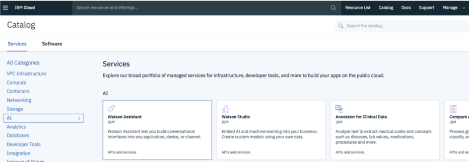
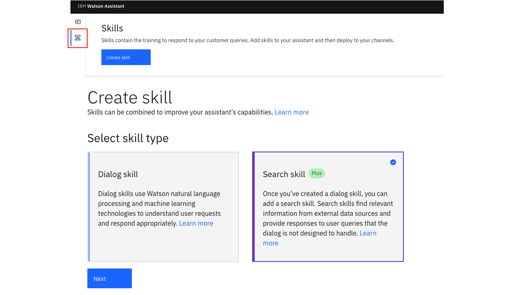
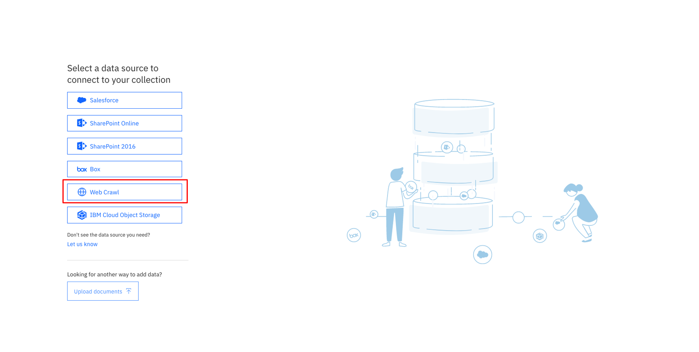
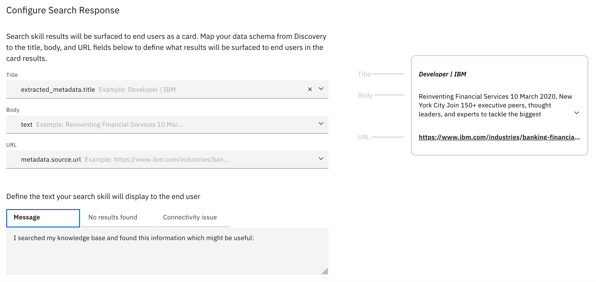
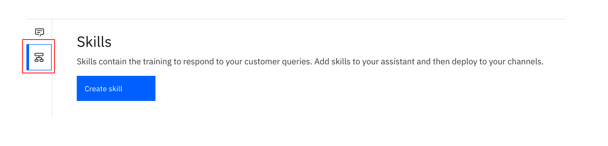
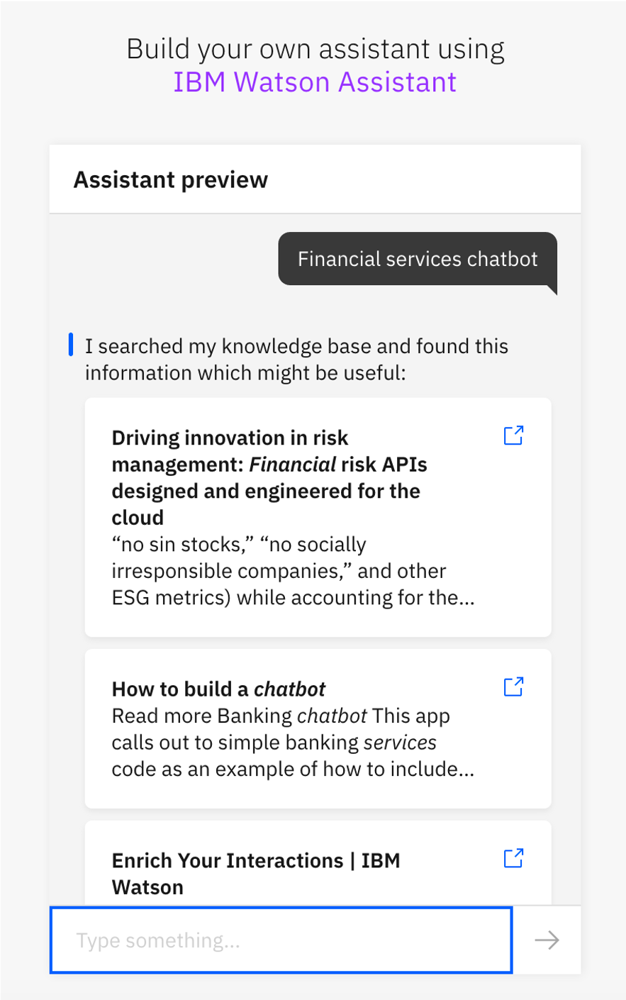

<h1 align="center" style="border-bottom: none;">:rocket: IBM Digital Tech Tutorial: Watson Assistant Search Skill</h1>
<h3 align="center">In this hands-on tutorial you will create a new IBM Watson Assistant and Discovery Service on the IBM Cloud and deploy your solution</h3>

## Prerequisites

1. Sign up for an [IBM Cloud account](https://cloud.ibm.com/registration).
2. Fill in the required information and press the „Create Account“ button.
3. After you submit your registration, you will receive an e-mail from the IBM Cloud team with details about your account. In this e-mail, you will need to click the link provided to confirm your registration.
4. Now you should be able to login to your new IBM Cloud account ;-)

## Configuring the Watson Assistant and Discovery service on the IBM Cloud

<h4>1) Create a Watson Assistant Service</h4>
After the login you will see your IBM Cloud Dashboard. In the upper menu bar click Catalog. In the Catalog section, click on the AI category, then select Watson Assistant. On the next page select the Lite Plan - or the Plus Trial, Standard or Plus Plan for further deployment options - and you can also choose a region, where you would like to deploy your service as well as a service name. Click "Create".

Repeat this process to create a Watson Discovery Lite instance, which you will also find in the catalog under AI.

## How the Search Skill and Discovery work

You can add a search skill to your assistant to prevent the assistant from having to say things like, `I'm sorry. I can't help you with that`. Instead, the assistant can query existing company documents or data - like a webpage - to see whether any useful information can be found and shared with the customer. Therefore, the search skill searches for information from a data collection that you create by using the Discovery service. Discovery is a service that crawls, converts, and normalizes your unstructured data. The product applies data analysis and cognitive intuition to enrich your data such that you can more easily find and retrieve meaningful information from it later. Typically, the type of data collection you add to Discovery and access from your assistant contains information that is owned by your company. This proprietary information can include FAQs, sales collateral, technical manuals, or papers written by subject matter experts.

The following diagram illustrates how user input is processed when both a dialog skill and a search skill are added to an assistant.

## Configuring the Watson Assistant & Search Skill on the IBM Cloud

<h4>1) Create a Watson Assistant Service</h4>
After the login you will see your IBM Cloud Dashboard. In the upper menu bar click Catalog. In the Catalog section, click on the AI category, then select Watson Assistant. On the next page select the Lite Plan - or the Plus Trial, Standard or Plus Plan for further deployment options - and you can also choose a region, where you would like to deploy your service as well as a service name. Click "Create".

<h4>2) Access your Watson Assistant Service</h4>
Go back to your IBM Cloud Dashboard by clicking the IBM Cloud Logo on the upper left. Under services you will find the Watson Assistant Service in the corresponding region. Access your service by launching it. Afterwards click on Skills in the menu on the left and create a new Search Skill.

<h4>3) Connect to a Watson Discovery Instance</h4>
Connect to an existing Discovery instance or create a new one. Afterwards create a new collection. In Watson Discovery click lets get started and select Web Crawl as a data source. Provide the URL you want Watson Discovery to crawl, select a frequency - for instance once a day and the language of your website. 

<h4>4) Configure the search response</h4>
Configure the title, body, and URL fields to define how the search results will be displayed for the end user. 

## Deploy the Assistant with Search Skill

To deploy your assistant click on Assistants, then click on create assistant and give your integration a name. Make sure the "Enable Preview Link" checkbox is checked. Then click on add a search skill to select your previously configured search skill. Afterwards go to the Preview Link and visit the provided URL. Your Assistant will provide you with search results.

The Preview Link Chat App will look like this: 

## If you have any questions just contact me
Felix Augenstein 
Digital Tech Ecosystem & Developer Representative @IBM 
Twitter: [@F_Augenstein](https://twitter.com/F_Augenstein) 
LinkedIn: [linkedin.com/in/felixaugenstein](https://www.linkedin.com/in/felixaugenstein/)
